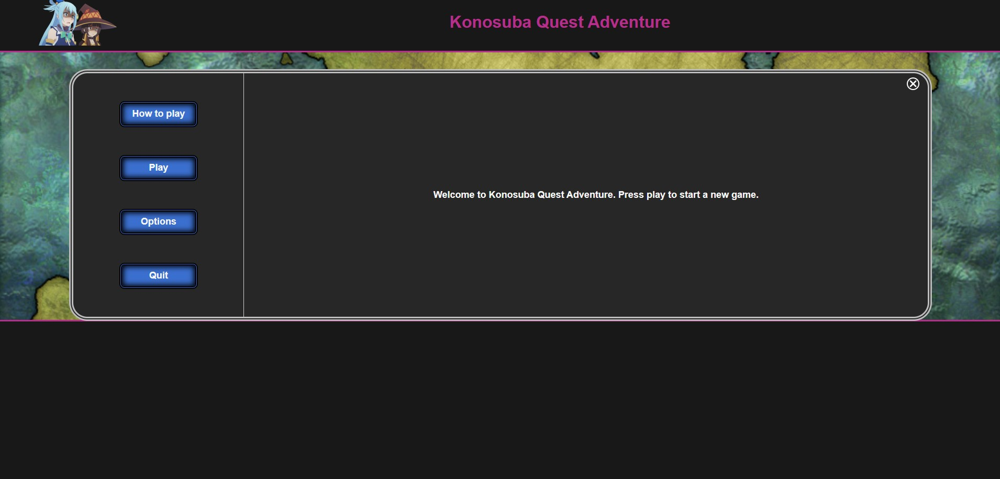

# 
KONOSUBA QUEST ADVENTURE

***

Konosuba Quest Adventure is a simple turn based and world based game. 

***

***

### 
How To Play

***

After clicking play there will be 3 worlds you can enter.
World 2 and 3 will be locked until you beat the previous world.
Once you beat all the worlds you beat the game.

Combat is turn based.
Select your action for each of your team.
The enemy will attack after your last team memeber performs their action.

To start combat you must first click on an enemy to select it to be attacked.

* Kazuma is well rounded 
* Darkness is good at taking damage but bad at attacking
* Megumin can destroy everyone on screen  - but only once per world -
* Aqua can do a little damage and can heal